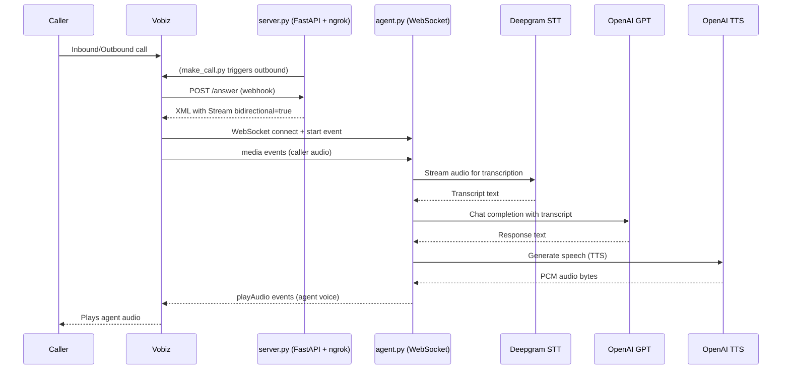

# 🤖 Vobiz AI Voice Agent: The Ultimate Technical Guide

A production-grade, low-layer AI voice agent implementation. This system bridges the gap between traditional PSTN (Public Switched Telephone Network) and modern AI Intelligence using high-performance, real-time streaming.

---

## 📑 Table of Contents
1. [Introduction](#1-introduction)
2. [High-Level Architecture](#2-high-level-architecture)
3. [The Orchestration Layer (server.py)](#3-the-orchestration-layer-serverpy)
4. [The Intelligence Layer (agent.py)](#4-the-intelligence-layer-agentpy)
5. [The Connectivity Layer (make_call.py)](#5-the-connectivity-layer-make_callpy)
6. [Vobiz Webhook Reference (HTTP)](#6-vobiz-webhook-reference-http)
7. [WebSocket Event Protocol (JSON)](#7-websocket-event-protocol-json)
8. [Audio Engineering & Math](#8-audio-engineering--math)
9. [Barge-in & Interruption Logic](#9-barge-in--interruption-logic)
10. [Detailed Webhook Lifecycle](#10-detailed-webhook-lifecycle)
11. [Stream Implementation Best Practices](#11-stream-implementation-best-practices)
12. [Setup & Installation](#12-setup--installation)
13. [Troubleshooting & FAQ](#13-troubleshooting--faq)

---

## 1. Introduction
The **Vobiz AI Voice Agent** is a "Human-in-the-Loop" style automation that allows an AI (OpenAI GPT-4o) to handle real phone calls. It goes far beyond standard IVRs by using **Natural Language Understanding (NLU)** to drive dynamic conversations.

It converts sound to text (Deepgram), text to thought (OpenAI LLM), and thought back to sound (OpenAI TTS). It supports **Barge-in**, meaning if you interrupt the AI, it stops talking and listens—just like a human.

---

### Visual Sequence


### Protocol Stack
- **Telephony:** SIP/PSTN -> Vobiz XML Webhooks
- **Streaming:** WebSocket (WSS) -> JSON Encapsulated Audio
- **Transcription:** WebSocket -> Deepgram Nova-2
- **Synthesis:** HTTP Stream -> OpenAI TTS-1

---

## 3. The Orchestration Layer (`server.py`)

`server.py` acts as the gateway and security layer. Its primary jobs are:
- **Tunneling:** Starts `pyngrok` to provide a public endpoint for Vobiz.
- **Webhook Handling:** Responds to Answer/Hangup/Status requests from Vobiz.
- **WebSocket Proxy:** Routes WebSocket traffic from the public ngrok endpoint (port 5000) to the internal agent (port 5001).

### Internal Sequence of `server.py`:
1. **Startup:** Reads `.env`, initializes `ngrok`, and concurrently starts the FastAPI app and the `agent.py` server thread.
2. **Answer Event:** When Vobiz hits `/answer`, it fetches the active ngrok URL and builds the `<Stream>` XML.
3. **Proxy Logic:** Any connection hitting `/ws` is upgraded to a WebSocket and piped directly to the local agent loop using Starlette's `websocket` handling.

---

## 4. The Intelligence Layer (`agent.py`)

`agent.py` is the stateful "brain" of the call. For every call, it spawns a `CallSession` object.

### The `CallSession` Lifecycle:
- **`__init__`**: Initializes conversation history with a system prompt.
- **`start_deepgram`**: Opens a raw WebSocket to Deepgram with the correct telephony headers: `{"Authorization": "Token <KEY>"}`.
- **`_listen_deepgram`**: A background task that stays open for the duration of the call, parsing JSON results from Deepgram and handling the "silence timer."
- **`handle_message`**: The main router for Vobiz events (`start`, `media`, `stop`, `playedStream`, `clearedAudio`).
- **`_play_audio`**: Chops synthesized audio into 20ms mu-law chunks and pushes them to Vobiz.

---

## 5. The Connectivity Layer (`make_call.py`)

A utility to automate the Vobiz REST API. It uses the `requests` library to send a `POST` to `https://api.vobiz.ai/api/v1/Account/{auth_id}/Call/`.

**Key Feature: Auto-Discovery**
The script pings `http://localhost:5000/health` (the local `server.py`) to find the dynamically generated ngrok URL. This saves you from manually copy-pasting URLs every time you restart the project.

---

## 6. Vobiz Webhook Reference (HTTP)

Vobiz uses HTTP POST requests with `application/x-www-form-urlencoded` payloads.

### 6.1 Call Answer (`POST /answer`)
Triggered when an incoming call arrives or an outbound call connects.
| Parameter | Description |
|-----------|-------------|
| `CallUUID` | Unique ID for the call session. |
| `From` | The caller's number. |
| `To` | The number being called. |
| `Direction` | `inbound` or `outbound`. |

**Expected XML Response:**
```xml
<Response>
    <Stream 
        bidirectional="true" 
        keepCallAlive="true" 
        contentType="audio/x-mulaw;rate=8000"
        statusCallbackUrl="https://your-ngrok-url/stream-status"
        statusCallbackMethod="POST">
        wss://your-ngrok-url/ws
    </Stream>
</Response>
```

### 6.2 Call Hangup (`POST /hangup`)
Triggered when the call is fully terminated.
| Parameter | Description |
|-----------|-------------|
| `CallUUID` | Unique ID of the finished call. |
| `Duration` | Total length in seconds. |
| `HangupCause` | Why the call ended (`NORMAL_CLEARING`, `ORIGINATOR_CANCEL`, etc). |

---

## 7. WebSocket Event Protocol (JSON)

Communications over the WebSocket use a JSON-framed binary protocol.

### 7.1 Events FROM Vobiz

#### `start`
The first packet sent. Provides context.
```json
{
  "event": "start",
  "streamId": "s-123",
  "callId": "c-456",
  "mediaServer": "vobiz-cloud-01"
}
```

#### `media`
Sent every 20ms. Contains raw caller audio.
```json
{
  "event": "media",
  "media": {
    "payload": "base64_encoded_8khz_mulaw_bytes",
    "track": "inbound"
  }
}
```

#### `playedStream`
An acknowledgement that the agent's voice reached the caller.
```json
{
  "event": "playedStream",
  "streamId": "s-123",
  "name": "greeting_checkpoint"
}
```

#### `clearedAudio`
Acknowledgement that the playback buffer was cleared after a `clearAudio` command.
```json
{
  "event": "clearedAudio",
  "streamId": "s-123"
}
```

### 7.2 Commands TO Vobiz

#### `playAudio`
The primary way to "speak." 
```json
{
  "event": "playAudio",
  "media": {
    "contentType": "audio/x-mulaw",
    "sampleRate": 8000,
    "payload": "base64_encoded_8khz_mulaw_bytes"
  }
}
```

#### `clearAudio`
Interruption command. Stop playing everything in the buffer right now.
```json
{
  "event": "clearAudio",
  "streamId": "s-123"
}
```

#### `checkpoint`
A "marker" in the audio stream. Vobiz replies with `playedStream` once the audio *preceding* this marker finishes playing.
```json
{
  "event": "checkpoint",
  "streamId": "s-123",
  "name": "step_1_complete"
}
```

---

## 8. Audio Engineering & Math

Telephony audio is unique. We deal with **G.711 mu-law (PCMU)**.

### Why Mu-Law?
Standard 16-bit audio is linear. Mu-law is **logarithmic**. It compresses 14 bits of dynamic range into 8 bits by prioritizing the volume levels where human speech is most common. This reduction is critical for the bandwidth constraints of global telephony.

### The Conversion Algorithm in `agent.py`:
1. **Input:** OpenAI TTS yields 24,000Hz PCM 16-bit.
2. **Resampling:** We calculate the ratio (3:1) and pick every 3rd sample (roughly) using a linear interpolation logic to reach the telephony-standard 8kHz.
3. **Mu-Law Translation:**
   - Take the 16-bit sample (`-32768` to `32767`).
   - Add a bias of `33`.
   - Calculate the exponent and mantissa.
   - Bit-shift into a single 8-bit byte.

---

## 9. Barge-in & Interruption Logic

Barge-in makes an AI feel "real." Without it, the AI is a "radio" that won't stop playing even if you shout.

### Logic Flow:
1. **Audio Monitoring:** While playing responses, the agent continuously streams caller audio to Deepgram.
2. **Transcript Arrives:** Deepgram returns a "Final" transcript.
3. **Detection:** `agent.py` iterates through the transcript. If text is present, it triggers `self._clear_audio()`.
4. **Action:** Vobiz clears its buffer, the `is_playing` flag is set to `False`, and the agent starts processing the new user input immediately.

---

## 10. Detailed Webhook Lifecycle

Understanding the sequence of HTTP requests is vital for debugging.

### Phase 1: Initiation
- **Incoming Call:** Vobiz hits `/answer`.
- **Outbound Call:** `make_call.py` hits Vobiz API -> Vobiz dials -> User answers -> Vobiz hits `/answer`.

### Phase 2: Streaming
- Upon processing the `<Stream>` XML, Vobiz sends a **StartStream** event to the `statusCallbackUrl`.
- **WebSocket Handshake:** Vobiz connects to `wss://.../ws`.
- **Checkpoint Sync:** When the agent sends audio + a `checkpoint`, Vobiz sends a **PlayedStream** event to the `statusCallbackUrl` once the audio finishes.

### Phase 3: Hangup
- When the user hangs up, the WebSocket is closed (`stop` event).
- Vobiz sends a **StopStream** event to the `statusCallbackUrl`.
- Vobiz sends a final **POST /hangup** to the configured Hangup URL.

---

## 11. Stream Implementation Best Practices

1. **Fast Responses:** Webhooks must respond within 1-2 seconds. Use `gpt-4o-mini` for speed.
2. **Stateless Logic:** Treat each call independently. Use `CallUUID` to track logs.
3. **Endpointing:** Deepgram's `endpointing=300` ensures we catch the end of a sentence quickly without long awkward pauses.
4. **Resampling Quality:** Always use linear interpolation or better when downsampling from 24kHz to 8kHz to avoid "metallic" aliasing in the AI's voice.
5. **Memory Management:** Clean up the `conversation_history` and close WebSocket connections on the `stop` event to prevent memory leaks in the server.

---

## 12. Setup & Installation

### Prerequisites
- Python 3.11+
- [ngrok](https://ngrok.com) installed and authenticated.
- API Keys for Deepgram and OpenAI.
- Vobiz Auth ID and Auth Token.

### Installation
```bash
# Clone the repository
git clone https://github.com/Piyush-sahoo/Vobiz-Websockets.git
cd Vobiz-Websockets

# Setup environment
python -m venv venv
source venv/bin/activate  # Or venv\Scripts\activate on Windows
pip install -r requirements.txt

# Configure settings
cp .env.example .env
# Fill out your .env file
```

### Running
```bash
# terminal 1
python server.py

# terminal 2
python make_call.py
```

---

## 13. Troubleshooting & FAQ

**Error: "python-multipart must be installed"**
- Fix: `pip install python-multipart`. This is required by FastAPI to handle the form-encoded data Vobiz sends.

**Error: "'ClientConnection' object has no attribute 'open'"**
- Fix: This project is updated for `websockets` v16. We use try/except blocks instead of checking the `.open` property.

**Issue: "Agent is slow to respond"**
- Cause: Usually network latency or a high `asyncio.sleep` value in silence detection.
- Solution: Reduce `utterance_end_ms` in the Deepgram config or reduce the silence sleep timer in `agent.py`.

**Issue: "I can't hear the AI"**
- Check the console logs. Ensure `generate_tts_audio` is successfully returning bytes. Ensure the Vobiz `AnswerURL` is correctly set to your ngrok tunnel URL.

---

## 📚 Appendix: Example XML & JSON

### Answer Response XML
```xml
<?xml version="1.0" encoding="UTF-8"?>
<Response>
    <Stream bidirectional="true" keepCallAlive="true" contentType="audio/x-mulaw;rate=8000" statusCallbackUrl="https://.../stream-status">
        wss://your-url.ngrok-free.app/ws
    </Stream>
</Response>
```

### WebSocket Media Packet
```json
{
  "event": "media",
  "media": {
    "payload": "m6D...base64...",
    "track": "inbound",
    "chunkId": "42"
  }
}
```

### WebSocket Stop Packet
```json
{
  "event": "stop",
  "streamId": "227d997a-0af4-447c-a3f3-b243e902e527"
}
```

---

## ⚖️ License
MIT License. Created for Vobiz Telephony integration patterns.
Developed by Piyush Sahoo.
# Vobiz-Python-XML
